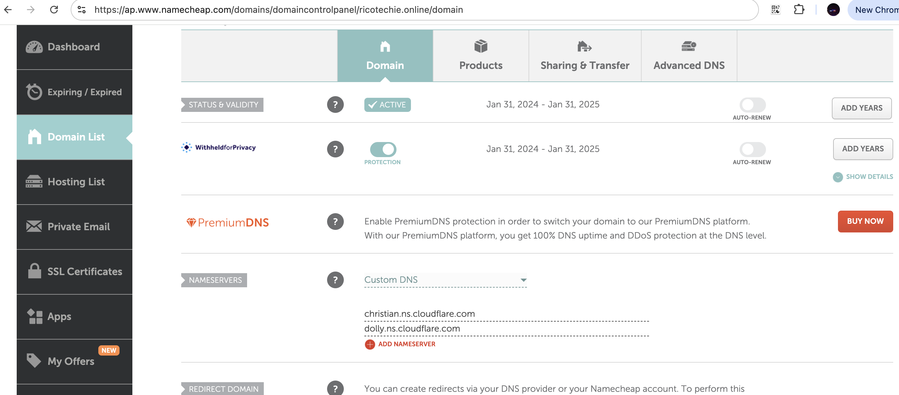

# Name cheap

Setup Cloudflare as a DNS provider 

1) Go to your domain page on Namecheap (e.g. `https://ap.www.namecheap.com/domains/domaincontrolpanel/ricotechie.online/domain`)

2) Goto **Nameservers** section
  
    2.1 From the dropdown choose **Custom DNS**
    
    2.2 Enter the Cloudflare nameservers you copied [earlier](../CloudFlare/CloudFlare.md#copy-cloudflare-nameservers) 

