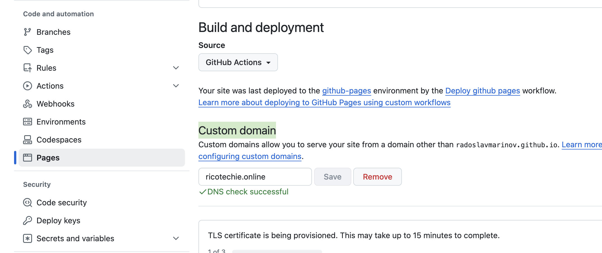

# Github pages configuration for custom domain
1) Goto your project/repository settings https://github.com/<username>/<repository-name>/settings/pages

2) Under **Custom domain** section enter your custom domain (e.g. ricotechie.online)

